# Predicting Developer Compensation in the US and UK Using Multiple Linear Regression and Random Forest
This study aims to predict developers' salaries by examining the impacts of human
capital, team workflow, personal efficacy, and education level. Two regression models
are employed: a linear model, which establishes baseline variables and identifies
significant predictors through stepwise selection, and a nonlinear random forest
model, which evaluates improvements over the linear model and identifies key
factors.

### Define the question
1. Can salary be predicted based on team workflows and personal efficacy? How
are these factors associated with salary?
2. Is education level a reliable indicator for predicting salary? How is it related to
salary?  

### Data collection
The data comes from Stack Overflow survey in 2023, over 90,000 developers around the world responded the survey.

### Literature Review
The first part will focus on the composition of salary, the second part will examine less tangible factors in the workplace, such as communication and employees' selfefficacy. The third part will discuss methods for comparing purchasing power.  

Points from literature review:
1. Labour theory from Adam Smith claims humans were viewed as valuable resources, while sveral studies proved that age, background ,major and prior
knowledge none of these features can predict success but personal confidence matters the most. 
2.  Polynomial features for curveness could better predict the salary than linear models, many studies have used machine learning method try to predict the salary and artificial neural networks (ANN) tends to have the highest accuracy. 
3. the working
environment reflects employers’ complex problem-solving (CPS) skills to some extent and is linked to employee salaries. 
4. Big Mac Index is used in this paper to compare price levels across countries.

### EDA 
The datapoints remaining after filtering only these three occupations in US and UK are 14678.

 

Missing values and outliers handling: Delete outliars (salary > IQR99) and anomalies.  
Data transformation:
Ordinal encoding on Team questions, dummy encoding the skills. 

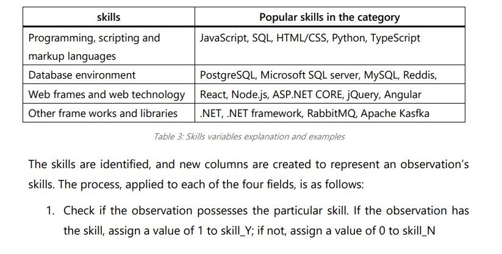
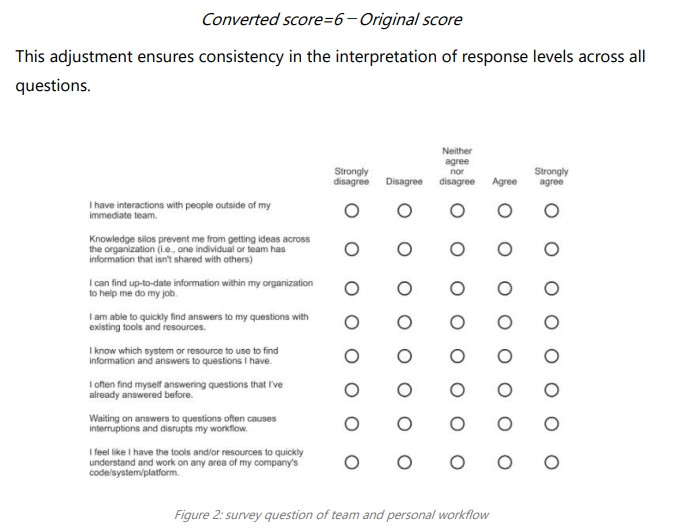

 

Compensation Analysis: 

  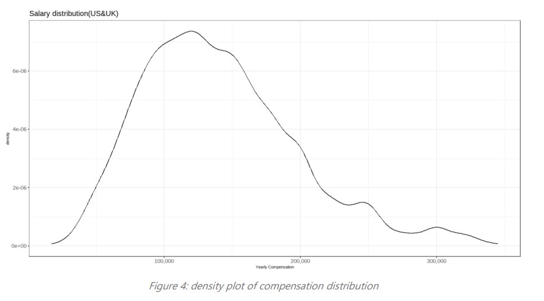
  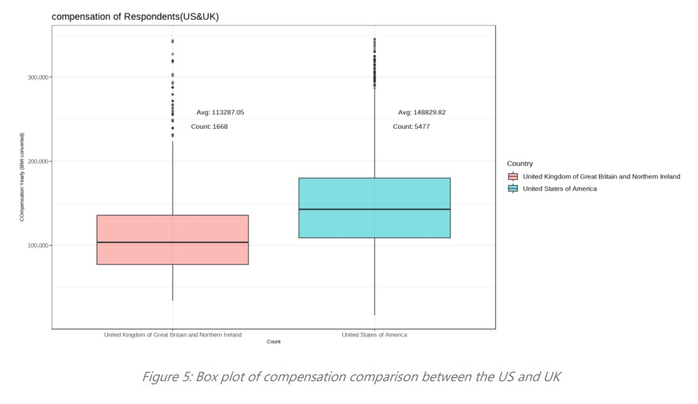

  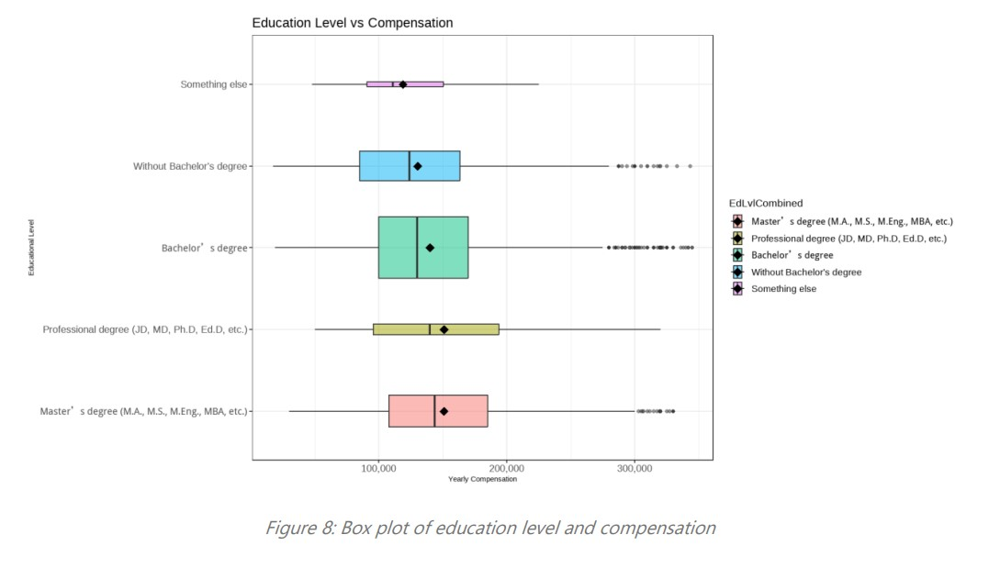
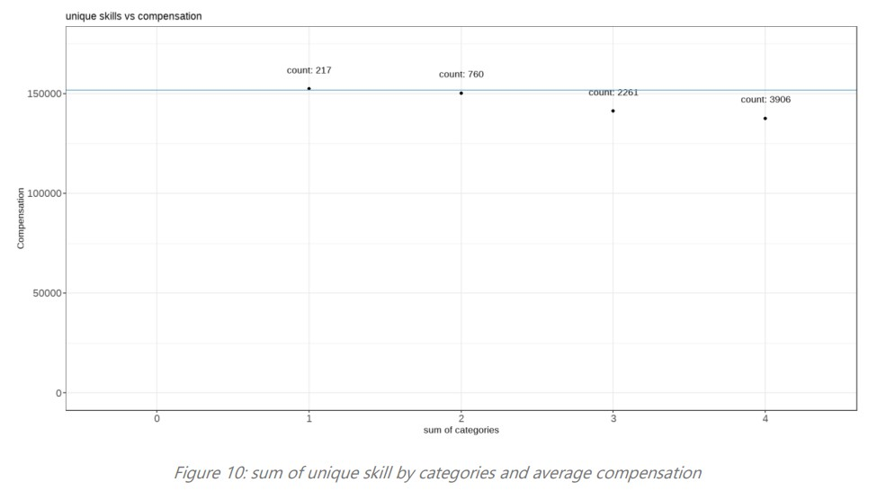

 

Team & Personal workflow analysis: 

  
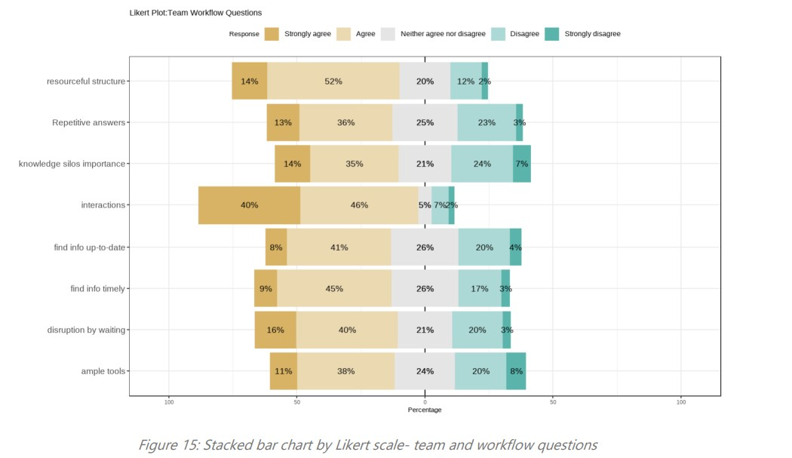

 

### Multiple Linear Regression  
Multiple regression is a suitable method for answering research questions whether grounded in strong or weak theory.   Using regression as the first step could give us preliminary understanding of research question. 

Checking four assumptions: 
1. Linearity
2. Multicollinearity
3. Homoscedasticity
4. Normality of residuals

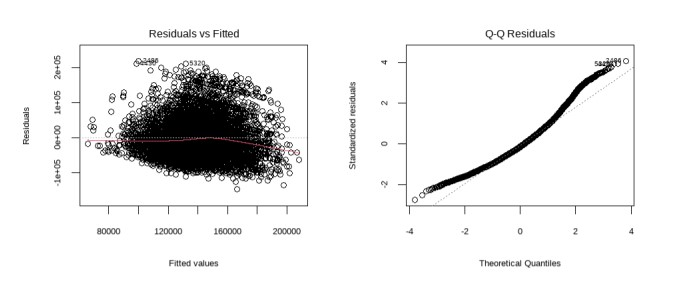
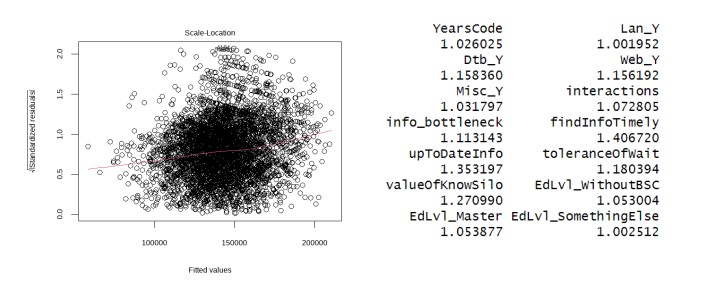

 

To avoid too many variables in a model, stepwise method is implemented. 

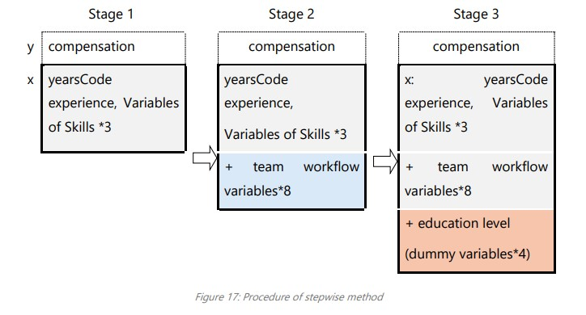

 

Run the model in R by adding variables selected by stepwise method: 
 

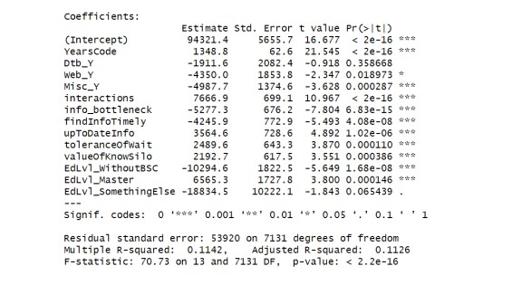

 

### Random Forest 
Random forests combine the output of multiple decision trees to generate a single result. 
- First step-bootstrapping: This technique creates diverse samples, for each sample a draw with replacement is conducted.
- Second step- Independent model training: : Each model is trained independently on its corresponding Bootstrap sample.
- Third step- Aggregate: Predictions of all the models are combined and a vote is taken to compute a more accurate estimate.

Tuning Hyperparameters:  
- nodesize: The number of observations a terminal node should hold. In other words, the number of examples in each cell below node size is not split. As node size decreases, the tree size increases.
- mtry: Number of variables being selected at each split. A small mtry number is not encourage as it may cause overfitting. 
- ntree: The number of tree. The larger the tree is, the more computational resources it takes. 

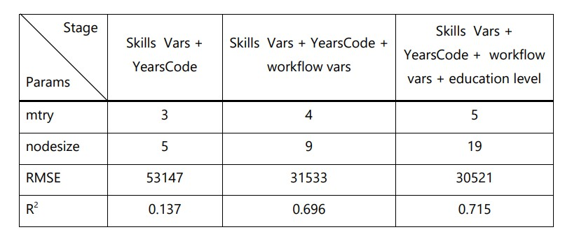
 

Interpret the result:  
“Feature Importance” is generated to help interpret by allowing us to know which features are most predictive. Feature importance in random forests measures contribution to reducing error across multiple decision paths, not just direct associations. Other factors, such as confounding variables, may also have effect.

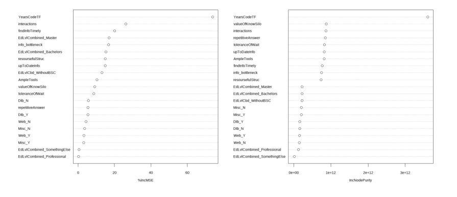
 
When education level was added, the variable "Master" ranked 4th in importance,
while "Bachelors" ranked 6th among all variables. 

Evaluation regression model: 
A metric that widely used is RMSE, this research RMSE and R2 are used to compare model errors in regression. 

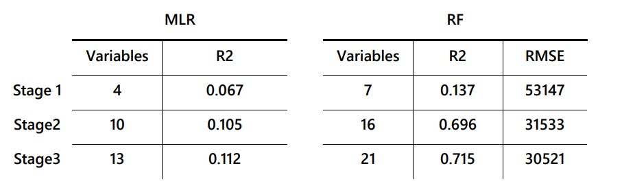
 
A significant jump in R² occurs in the second stage of the random forest model, indicating that
the added variables, particularly the team workflow factors, enhance the prediction of
the target variable—salary. 
YearsCode is both statistically significant and positively correlated with compensation
in the regression model, and it emerges as the most critical predictor in the random
forest model. In contrast, other skills show less significance and minimal impact in
the random forest model.  
In the final stage, "Masters" had a positive coefficient, while “withoutBSc" had a negative coefficient compared to the reference category
"Bachelors."  Overall, the R² in random forest was much higher than in multiple regression, suggesting that the random forest model captures non-linear relationships and interactions that the linear regression model is unable to account
for.

### Findings and Discussions 
In the linear regression, the results from the first stage clearly show that experience,
measured by YearsCode, is crucial in determining compensation. Interestingly, skills, which might intuitively seem important, do not play as significant a role. In fact, the regression results, corroborated by the visual analysis, suggest that
as individuals accumulate more skills, their compensation decreases.  
In the second stage, the R² significantly increases, indicating that team workflow
factors are highly predictive of salary. 
The variable "info_bottleneck," which was transformed from three frequency-related
questions, also shows a negative effect on compensation. Therefore the following hypotheses can be drawn: 
- Frequently needing help from outside your immediate team is beneficial 
- Frequently interacting with people outside your immediate team is favourable 
- Frequently encountering knowledge silos at work is prone to have a higher salary. 

It's worth noting that the second statement about cross-department interactions
somewhat overlaps with the predictor "interaction," which has a strong positive
correlation with compensation. This suggests that frequent interactions with
colleagues, whether within or outside the immediate team, are likely beneficial for
career growth and compensation.   

The model's analysis reveals a clear trend: higher education levels generally correlate
with better salaries, though the differences can be subtle. 
Overall, our findings reveal that experience is the most significant predictor of
salary. While having multiple skills may seem beneficial, specializing in fewer skills
can sometimes yield better financial returns. Additionally, interaction with colleagues
was found to significantly influence salary. Positive traits associated with higher
compensation include minimizing waiting times, timely skill updates, and openness
to sharing knowledge.

